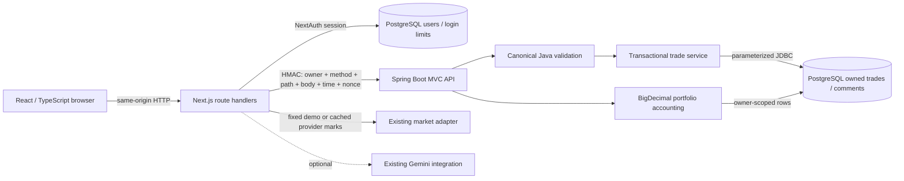

# Architecture

## Responsibilities

`backend/src/main/java/com/tradegoons` is one domain API, not a collection of microservices. Spring MVC supplies REST routing and JSON, Spring JDBC supplies bound SQL and transactions, and Flyway applies one additive index migration. No ORM or additional AI provider is introduced.

`TradeContract` normalizes/validates create, merged edit and CSV data. `TradeService` owns every trade/comment database operation. An edit locks the owned row, merges only allowed fields, validates the full result, then updates it. Close locks the same row: identical exit-price retries return the stored close; conflicting retries and edits of closed rows return 409. The transaction is the concurrency boundary. Inserts and their initial comments are atomic. Import commits reuse insertion/validation and PostgreSQL's existing `(userId, importKey)` uniqueness; the old fingerprint format is preserved.

`Accounting` is the only P&L formula. `PortfolioService` computes rounded position results, realized and marked unrealized totals, gross exposure, cost concentration, daily marked movement, win rate and reference equity. It treats missing marks explicitly and does not mark options using underlying stock prices. `lib/ledger.ts` only obtains marks and calls Java. The former TypeScript accounting formula and SQL aggregate implementation have been removed. Chart coordinates and risk/sizing previews can still use browser numbers; they never determine saved P&L.

The Next.js boundary retains session management, same-origin mutation checks, CSV syntax/export escaping and Gemini. `lib/trade-api.ts` is server-side transport with a ten-second timeout, typed responses and consistent failure handling. The internal secret is never sent to the browser. Compatibility number fields serve existing components; the exact `decimals` object prevents an edit from round-tripping through binary floating point. Java always returns financial values as decimal strings.

## Security boundaries

The browser cannot choose its owner: route handlers read the authenticated session. Java accepts only requests signed over method, encoded path, owner, Unix timestamp, random nonce and SHA-256 body digest. It uses constant-time signature comparison, a 30-second clock window and a bounded 60-second replay cache. Java reloads the user and independently enforces disabled/read-only flags; every SQL lookup includes ownership. Existing composite foreign keys protect comments. No RLS claim is made.

This is a **single-instance, private-network** service design. The nonce cache is JVM-local, so it is not a distributed replay barrier. Network encryption, key rotation, rate limiting and coordinated replay protection need separate operational design before exposing/scaling it. The HTTP process runs with the limited application database role. Only the explicit migration process receives the privileged connection. Assets and login limits remain in the existing Next.js/Prisma subsystem; they do not implement trade operations.

## JavaScript fundamentals in the TypeScript UI

- `fetch` returns a **Promise**. `async` functions return promises too; `await` resumes after settlement without blocking the browser thread. A resolved HTTP 400/503 is not a rejected promise, so handlers explicitly inspect `response.ok`.
- The dashboard's submit **event** calls `preventDefault()`, sets saving state, awaits create/edit, reloads authoritative data, and clears pending state in `finally`. Close/delete errors leave an explicit failure message. Buttons disable while their request is pending.
- `Promise.all` in the market adapter path starts independent quote requests together. Each quote catches its own provider failure so a missing quote becomes an honest unavailable mark instead of canceling the entire page.
- `useEffect` cleanup guards prevent late responses from updating a screen after its filters/page change. Sets/maps handle selected IDs and returned valuations. Event propagation is stopped for action buttons inside clickable cards. The trade-detail scroll listener is removed on unmount.
- Loading, successful empty lists and failures are distinct React states. Playwright intercepts a delayed request and a 503 to prove those states, then removes the interception to verify recovery. Those intercepted checks are UI tests, separate from the real PostgreSQL lifecycle scenario.

## Design limits

The Java API and Next.js require two processes and one additional network hop; no claim is made that this is faster than the former implementation. JDBC keeps the existing schema explicit and makes locking/ownership reviewable, at the cost of hand-written mapping. Lists are not paginated and portfolio calculation is linear in the owner's selected rows. Deleted journal rows are removed; this is not an immutable broker execution ledger. Live Gemini success and real market-data availability are not established by the offline tests.
