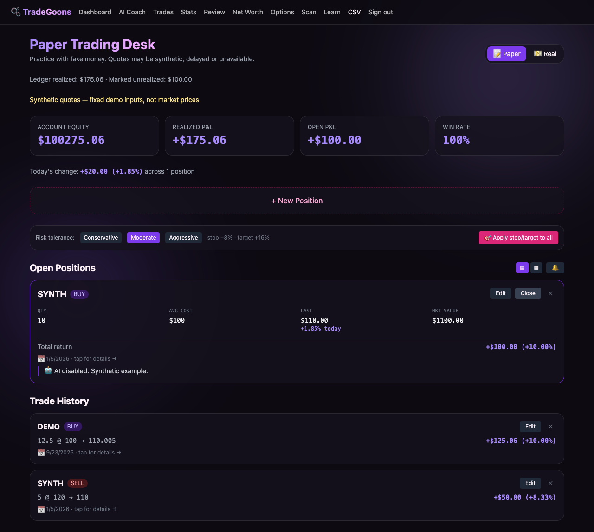
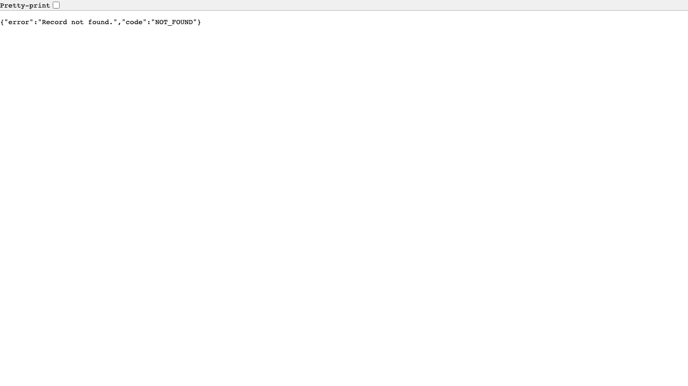

# Three-minute local walkthrough

Run the root README setup, then sign in using synthetic A's generated local password. No external key is needed. Reset the fixtures with `npm run db:seed` before repeating.

**0:00–0:35 — Existing React interface.** Show the synthetic-data label, seeded $50 realized and $100 unrealized. Create DEMO, STOCK, BUY, 10 shares at $100. The form uses browser events, pending state and an awaited same-origin request.

**0:35–1:15 — Complete lifecycle.** Edit quantity to 12.5, then close at $110.005. Show $125.06 for that lot and $175.06 portfolio realized P&L. Java computes `(110.005 − 100) × 12.5 = 125.0625`, rounded HALF_UP to cents. Reload to show persistence.

**1:15–1:45 — Security boundary.** While signed in as A, open `/api/trades/synthetic-b-open`: 404. Show the test covering read/update/delete/comments/export and two separate users. A hidden button is not authorization; ownership is in server-side queries.

**1:45–2:25 — Trace the code.** Follow `app/page.tsx` → Next.js route → `lib/trade-api.ts` signed transport → Java `TradeContract`/`TradeService` → PostgreSQL. Show `Accounting` and the row lock for repeated close. Explain why Next.js no longer has a second P&L implementation.

**2:25–3:00 — Evidence and limits.** Show JUnit/JaCoCo, the Playwright lifecycle, migration/rollback instructions and all six benchmark runs. Explain that timings are local short bursts, options need contract marks, and Gemini is optional. This walkthrough is reproducible instructions plus captured test screenshots; it is not a recording of a hosted Java deployment.
